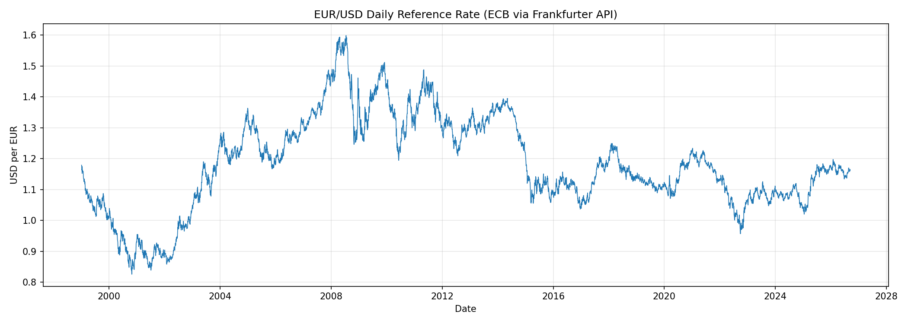
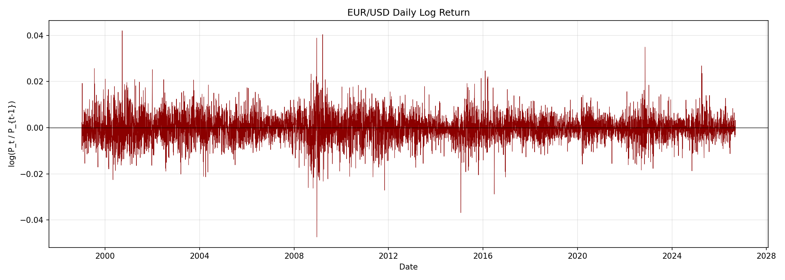
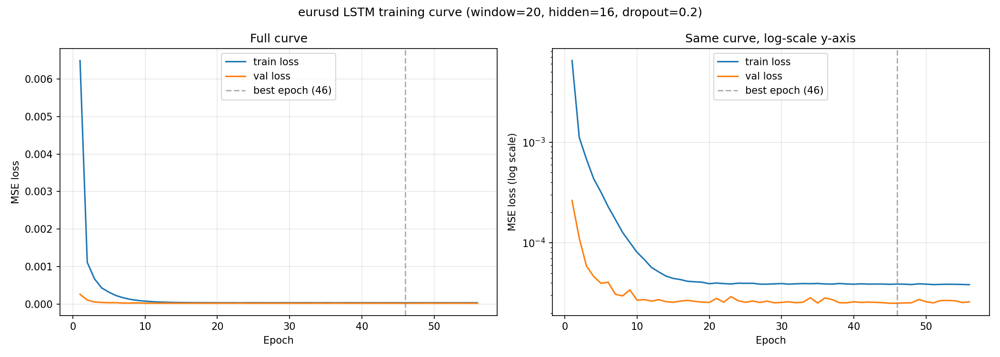

# FX Rate Forecasting

A time-series forecasting project on three major currency pairs
(EUR/USD, GBP/USD, USD/JPY), progressing from a naive baseline through
classical statistics (ARIMA/SARIMA), gradient-boosted trees (XGBoost),
and deep learning (LSTM). FX was chosen deliberately as a hard case:
these are three of the most liquid, heavily-traded instruments in the
world, which makes them a genuine stress test for whether any of these
methods can find exploitable short-horizon structure at all - not a
softball problem picked to guarantee an impressive-looking result.




## Key Finding

**Across all three currency pairs and all three model families, none of
the models beats a naive "tomorrow's return = zero" baseline.** 18 model
x pair x period comparisons (3 pairs x 3 non-naive models x 2 held-out
periods) were run; not one shows a real, test-surviving improvement over
naive. Two results looked like possible exceptions on first pass and
were both investigated and ruled out before being written up (see
"Results" below) - the investigation itself, not just the headline
number, is the point: this is a project about validating claims
rigorously, and a null result reached honestly is worth more than a
positive one that wouldn't survive scrutiny.

This is consistent with weak-form market efficiency: for a highly
liquid, continuously-traded FX pair, price history alone (lags, rolling
volatility, calendar effects) shouldn't be expected to predict next-day
direction, and that's exactly what three structurally different
modeling approaches - linear, nonlinear-tabular, and deep-sequential -
all confirm here, independently, across three pairs with genuinely
different macro histories.

## Data

**Source: [Frankfurter API](https://frankfurter.dev)** (`api.frankfurter.dev/v1`)
- Free, no API key, no signup, no credit card at any tier.
- Republishes the European Central Bank's official daily reference rates
  - verified byte-for-byte identical to a direct pull from the ECB's own
  Statistical Data Warehouse on a sample of test dates.
- Daily granularity, full history from 1999-01-04 (the start of the
  Euro) through the present - no intraday data is used or available
  through this source.
- Two other candidates were evaluated and rejected: **exchangerate.host**
  (now requires an API key and, per its host apilayer, a credit card
  even to sign up) and a **direct ECB SDW pull** (works fine, identical
  data, but a more brittle SDMX format to maintain across three pairs).
  Full reasoning in `DECISIONS_AND_ISSUES_LOG.md` #1-#2.

**This is a reference rate, not a tradeable market close.** The ECB
publishes one official daily fixing per TARGET2 business day (a
concertation procedure among EU central banks, ~16:00 CET), not a
continuous market price. Results in this project describe that fixing
series - even a genuine predictive edge found against it would need
separate validation against real bid/ask spreads and execution timing
before it meant anything tradeable. Since this project's headline result
is a null finding, this doesn't change any conclusion here, but it's the
honest, complete description of what the data is. See
`DECISIONS_AND_ISSUES_LOG.md` #28.

**GBP/USD and USD/JPY are ECB-implied cross rates, not independently
quoted.** The ECB only fixes rates against EUR, so Frankfurter derives
GBP/USD as EUR/USD ÷ EUR/GBP (verified to match Frankfurter's own
directly-returned value to 4 decimal places) - standard, reliable
methodology, but a real provenance distinction from EUR/USD's directly-
published rate. See `DECISIONS_AND_ISSUES_LOG.md` #21.

**Pulled data:** all three pairs, daily close, 1999-01-04 to 2026-09-10
(7,090 rows each, identical trading calendar) -
`data/processed/{eurusd,gbpusd,usdjpy}_daily.csv`.

**Gap handling:** FX markets don't trade on weekends or Eurosystem
(TARGET2) holidays. These calendar gaps are real and expected - they are
**not** imputed or forward-filled. Every gap longer than a normal
weekend was checked and lines up with a known holiday closure. GBP/USD's
raw series includes one genuine single-day move beyond 5% - 2016-06-24,
the Brexit referendum result day, confirmed real against public
history, not a data defect (it falls inside the training window, so it
can't have influenced any held-out score). Full checks:
`DECISIONS_AND_ISSUES_LOG.md` #4, #22.

## Methodology

**Target: daily log return**, `r_t = ln(P_t / P_{t-1})`, not raw price.
An Augmented Dickey-Fuller test confirms raw price is non-stationary
(p > 0.3 for all three pairs) while log return is strongly stationary
(p < 1e-6 for all three) - re-run independently per pair, not assumed to
transfer from EUR/USD. This makes the baseline every model must beat
unambiguous: **predict r_t = 0**, the random-walk hypothesis. Full
evidence: `DECISIONS_AND_ISSUES_LOG.md` #5, #23.

**Features** (`src/feature_engineering.py`), shared across XGBoost and
LSTM:
- `lag_1`..`lag_5` - previous 5 trading days' log returns (one trading
  week; FX return autocorrelation is weak beyond a few days for a liquid
  major pair, so this wasn't extended without evidence it would help).
- `roll_mean_5`/`roll_std_5` and `roll_mean_20`/`roll_std_20` - rolling
  return statistics over 1 week and ~1 trading month. The std terms are
  a realized-volatility proxy, motivated by visible volatility
  clustering in the return series (below).
- `dow_mon`..`dow_fri` - one-hot day-of-week, kept as a candidate feature
  and left to importance analysis to confirm or reject, not pre-judged.



Every lag/rolling feature applies `.shift(1)` **before** any
`.rolling()` call, so a feature at row t only ever sees r_{t-1} and
earlier - verified by an explicit runtime assertion, not just asserted
in prose (`DECISIONS_AND_ISSUES_LOG.md` #6). LSTM sequences carry the
same discipline one level further: built independently per split (never
reaching across a train/val/test boundary), with their own runtime
leakage check on the input-window/target-date alignment
(`DECISIONS_AND_ISSUES_LOG.md` #18).

**Split** - chronological (never shuffled), identical calendar-year
boundaries for all three pairs:

| Split | Date range | Rows |
|---|---|---|
| Train | 1999-02-02 -> 2019-12-31 | 5,354 |
| Validation | 2020-01-02 -> 2023-12-29 | 1,027 |
| Test | 2024-01-02 -> 2026-09-10 | 688 |

The validation window deliberately spans both the COVID crash and the
2022 rate-hike shock; test is a clean, untouched, most-recent-~2.7-years
holdout. Feature scaling is fit only on train and applied (not re-fit)
to validation/test. Full reasoning: `DECISIONS_AND_ISSUES_LOG.md` #7.

**Tuning discipline, held to throughout:** every hyperparameter and
order-selection decision (ARIMA order, XGBoost grid search, LSTM early
stopping) is made against train/validation only. Test is scored exactly
once, at the end, per model per pair - never used to pick between
configurations. Where a result looked promising on validation (USD/JPY's
XGBoost, `DECISIONS_AND_ISSUES_LOG.md` #25) it was explicitly checked
against test before being trusted, not reported on the strength of
validation alone.

**Shared evaluation module** (`src/evaluation/evaluate.py`) scores every
model identically: RMSE/MAE on the log-return scale, RMSE/MAE
reconstructed to price level using the *true* previous price at each
step (not a chained forecast, to avoid compounding error), and
directional accuracy with an explicit tie policy (a day is excluded if
either the true or predicted return is exactly 0.0). Full reasoning:
`DECISIONS_AND_ISSUES_LOG.md` #9.

**Models, in order of build:**
1. **Naive persistence baseline** - predicts r_t = 0 every day. The
   mandatory reference point every other model is compared against.
2. **ARIMA** - order selected via ACF/PACF inspection plus an AIC/BIC
   grid search on train only, rerun independently per pair (pmdarima's
   `auto_arima` was attempted first but fails to import in this
   environment - numpy ABI incompatibility, `DECISIONS_AND_ISSUES_LOG.md`
   #8). Evaluated via one-step-ahead **walk-forward** forecasting across
   validation + test, refitting every 20 trading days.
3. **SARIMA** (weekly seasonal terms) - tested per pair, **rejected**
   every time on in-sample AIC evidence before spending walk-forward
   compute on it (`DECISIONS_AND_ISSUES_LOG.md` #11).
4. **XGBoost** - raw (unscaled) features, a 32-combination grid search
   over regularization parameters with early stopping on validation
   RMSE, rerun independently per pair. Evaluated with a single fit +
   one-shot predict, not walk-forward - a deliberate, justified
   difference from ARIMA's evaluation (features already encode true
   historical values regardless of when the model was fit), not an
   inconsistency; see `DECISIONS_AND_ISSUES_LOG.md` #13.
5. **LSTM** (PyTorch, not TensorFlow - TF's pip wheel requires AVX
   instructions unavailable under Rosetta 2 on this Apple Silicon Mac's
   x86_64 venv, `DECISIONS_AND_ISSUES_LOG.md` #17) - a small,
   deliberately-regularized single-layer LSTM (16 hidden units, 0.2
   dropout, 2,065 trainable parameters) over 20-day sequences of scaled
   features, same architecture reused across all three pairs, trained
   with early stopping on validation loss.

Every script above takes a `--prefix` argument and reruns unchanged for
`eurusd`/`gbpusd`/`usdjpy` - nothing was re-engineered per pair. Each
pair's ADF test, ARIMA order search, XGBoost hyperparameters, and LSTM
training were all rerun independently rather than reusing EUR/USD's
selections.

## Results

### EUR/USD

ACF/PACF inspection of training returns showed no lags meaningfully
outside the 95% significance band - visually close to white noise. The
AIC/BIC search selected **ARIMA(0,0,0)** (a plain constant-mean model).
XGBoost's 32-combination grid search **independently converged to
`best_iteration=0` in every configuration** - the first tree already
minimized validation RMSE, and every additional tree made it worse.

| Model | Period | RMSE (return) | MAE (return) | RMSE (price) | MAE (price) | Directional accuracy |
|---|---|---|---|---|---|---|
| Naive | val | 0.004976 | 0.003664 | 0.005412 | 0.004035 | undefined (100% ties) |
| ARIMA(0,0,0) | val | 0.004976 | 0.003664 | 0.005412 | 0.004036 | 49.2% |
| XGBoost | val | 0.004976 | 0.003664 | 0.005412 | 0.004035 | 51.2% |
| LSTM | val | 0.005003 | 0.003697 | 0.005441 | 0.004071 | 49.4% |
| Naive | test | 0.004212 | 0.002980 | 0.004687 | 0.003329 | undefined (100% ties) |
| ARIMA(0,0,0) | test | 0.004212 | 0.002981 | 0.004688 | 0.003329 | 51.0% |
| XGBoost | test | 0.004212 | 0.002980 | 0.004687 | 0.003329 | 51.6% |
| LSTM | test | 0.004282 | 0.003032 | 0.004765 | 0.003386 | 50.6% |

*(LSTM's row counts are 1,007/668, not 1,027/688 - a 20-day sequence
warm-up is dropped per split; not a systematically different period.)*

RMSE/MAE match across all four rows to 3-4 significant figures, and
directional accuracy never moves meaningfully off a coin flip (49-52%).
LSTM runs marginally *higher* than naive, not lower - the expected
footprint of a model with free parameters that found no real signal,
not an improvement. Feature importance (XGBoost, restricted to the
actually-deployed tree - `DECISIONS_AND_ISSUES_LOG.md` #14): only 3 of
14 features have any nonzero gain (`roll_std_20` dominant, then `lag_1`,
`lag_5`), and **day-of-week shows exactly zero importance**. Full
writeup: `DECISIONS_AND_ISSUES_LOG.md` #10-#20.

LSTM's training/validation loss converges to a flat, non-diverging
plateau by ~epoch 15-20 (early stopping at epoch 56) - genuine
convergence, not the instant degenerate stop XGBoost showed, and no
overfitting divergence either:



### GBP/USD

Same pipeline, rerun independently. GBP/USD's AIC/BIC search selected
**ARIMA(2,0,2)**, not the trivial null every other pair converged to -
corroborated by its ACF showing genuinely more autocorrelation than the
other two pairs (6 of 20 lags exceeding the significance band, vs.
EUR/USD's 3 and USD/JPY's 0).

| Model | Period | RMSE (return) | MAE (return) | RMSE (price) | MAE (price) | Directional accuracy |
|---|---|---|---|---|---|---|
| Naive | val | 0.006109 | 0.004431 | 0.007592 | 0.005604 | undefined (100% ties) |
| ARIMA(2,0,2) | val | 0.006118 | 0.004451 | 0.007604 | 0.005630 | 48.2% |
| XGBoost | val | 0.006109 | 0.004432 | 0.007592 | 0.005605 | 49.4% |
| LSTM | val | 0.006151 | 0.004481 | 0.007643 | 0.005666 | 49.3% |
| Naive | test | 0.004247 | 0.003114 | 0.005548 | 0.004075 | undefined (100% ties) |
| ARIMA(2,0,2) | test | 0.004261 | 0.003123 | 0.005565 | 0.004087 | 52.9% |
| XGBoost | test | 0.004249 | 0.003116 | 0.005549 | 0.004078 | 47.9% |
| LSTM | test | 0.004315 | 0.003178 | 0.005639 | 0.004162 | 46.2% |

**Investigated exception #1:** despite a "decisive" 13.5-point AIC
margin over the null model, ARIMA(2,0,2) performs marginally *worse*
than naive on both validation and test (ratio 1.0014 / 1.0031) - an
in-sample preference that never translated into out-of-sample skill,
plausibly related to the Brexit shock's autocorrelated aftermath in the
training window. XGBoost again converged to `best_iteration=0`; feature
importance was again `roll_std_20`-dominated. Full investigation:
`DECISIONS_AND_ISSUES_LOG.md` #24.

### USD/JPY

Same pipeline again; ADF and SARIMA checks both confirm the same
pattern. XGBoost's search behaved differently here - 314 deployed trees
rather than instant convergence, with a small validation improvement.

| Model | Period | RMSE (return) | MAE (return) | RMSE (price) | MAE (price) | Directional accuracy |
|---|---|---|---|---|---|---|
| Naive | val | 0.006105 | 0.004060 | 0.789008 | 0.509513 | undefined (100% ties) |
| ARIMA(0,0,0) | val | 0.006105 | 0.004060 | 0.789041 | 0.509420 | 50.5% |
| XGBoost | val | 0.006096 | 0.004054 | 0.787635 | 0.508737 | 54.6% |
| LSTM | val | 0.006151 | 0.004085 | 0.795305 | 0.512891 | 54.8% |
| Naive | test | 0.006149 | 0.004280 | 0.927657 | 0.648169 | undefined (100% ties) |
| ARIMA(0,0,0) | test | 0.006149 | 0.004275 | 0.927666 | 0.647410 | 56.9% |
| XGBoost | test | 0.006153 | 0.004280 | 0.928287 | 0.648226 | 46.3% |
| LSTM | test | 0.006210 | 0.004246 | 0.938074 | 0.643751 | 56.2% |

**Investigated exception #2:** USD/JPY's validation RMSE improvement
for XGBoost (ratio 0.9987) reverses to a small degradation on test
(ratio 1.0007) - checked and rejected, the textbook "improvement
evaporates on the untouched holdout" signature.

**The directional-accuracy numbers here are not evidence of real
skill.** USD/JPY's test period had 391 up-days vs. 296 down-days (56.8%
positive) - a genuine, well-known sustained uptrend. ARIMA's
walk-forward-updated constant predicted a **positive** return on all 688
test days (inherited drift from train+val history); a model that always
guesses the majority class in an imbalanced period scores above 50% by
construction, no real skill required. XGBoost's predictions skewed the
**opposite** way (403 negative vs. 285 positive) and scored *below* 50%
via the identical mechanism, in the identical period - confirming this
is each model's arbitrary constant-ish bias meeting a real trend, not a
genuine directional edge. RMSE (which doesn't care about class balance)
independently confirms this: every model is within ~1% of naive on both
periods. Full investigation: `DECISIONS_AND_ISSUES_LOG.md` #25-#26.

### Cross-Pair Comparison

Each model's RMSE ratio to naive, same pair and period
(`src/cross_pair_comparison.py`, `data/processed/cross_pair_comparison.csv`).
Across all 3 pairs x 3 non-naive models x 2 periods = **18 comparisons,
not one shows a ratio below 0.98** (a real >2% improvement over naive):

| Pair | Model | Val ratio | Test ratio |
|---|---|---|---|
| EUR/USD | ARIMA | 1.0001 | 1.0001 |
| EUR/USD | XGBoost | 1.0000 | 1.0000 |
| EUR/USD | LSTM | 1.0055 | 1.0167 |
| GBP/USD | ARIMA | 1.0014 | 1.0031 |
| GBP/USD | XGBoost | 1.0000 | 1.0003 |
| GBP/USD | LSTM | 1.0069 | 1.0158 |
| USD/JPY | ARIMA | 1.0000 | 1.0000 |
| USD/JPY | XGBoost | 0.9987 | 1.0007 |
| USD/JPY | LSTM | 1.0076 | 1.0099 |

Three structurally different model families, applied identically across
three pairs with genuinely different macro histories (EUR/USD's steady
multi-year cycles, GBP/USD's Brexit shock, USD/JPY's sustained
2022-2025 uptrend), converge on the same answer. The two results that
looked like possible exceptions were each investigated and traced to a
specific, understood mechanism rather than real predictive skill - which
is why this is a strengthened finding, not a weaker one for having
looked closer. Full reasoning: `DECISIONS_AND_ISSUES_LOG.md` #21-#27.

## Limitations

- **No model beats naive, on any pair.** This is the headline finding,
  not a caveat - stated here again because a "Limitations" section is
  where a less careful project would try to quietly explain away a null
  result. There's nothing to explain away: three model families, three
  pairs, 18 comparisons, one consistent answer.
- **This is a reference rate, not a tradeable market close** - see
  "Data" above. Doesn't change any conclusion here (the finding is
  null), but would matter immediately if a future extension of this
  project found an apparent edge.
- **Daily granularity only** - no intraday data was used or is available
  through this source. A different (paid, or exchange-direct) data
  source would be needed to test whether shorter-horizon structure
  exists; this project doesn't make any claim either way about
  intraday predictability.
- **GBP/USD and USD/JPY are ECB-implied cross rates**, not independently
  quoted the way EUR/USD is - standard methodology, verified accurate,
  but a real provenance distinction worth knowing.
- **Directional accuracy is not a safe metric on its own** for a
  trending series with imbalanced up/down day counts - USD/JPY's
  ARIMA/LSTM scored above 50% purely because their arbitrary constant
  bias happened to align with a real trend, while XGBoost's opposite
  bias scored below 50% via the same mechanism. Always cross-check
  against RMSE before trusting a directional-accuracy number.
- Full engineering log of every decision, issue, and rejected
  alternative - including several caught mid-build (a numpy/pmdarima
  ABI break, an XGBoost feature-importance extraction bug, a
  TensorFlow/Rosetta 2 incompatibility, and a fresh-install numpy/torch
  version break caught only by actually testing reproduction) - is kept
  in `DECISIONS_AND_ISSUES_LOG.md` (29 entries).

## How to Reproduce

```bash
python3 -m venv venv
source venv/bin/activate
pip install -r requirements.txt
```

`requirements.txt` pins `numpy<2` deliberately - `torch==2.2.2` predates
full numpy 2.x support, and a fresh install otherwise resolves numpy to
2.x and breaks `torch.from_numpy()` (used throughout the LSTM script)
with `RuntimeError: Numpy is not available`. Caught by actually testing
a from-scratch install rather than assuming reproducibility; see
`DECISIONS_AND_ISSUES_LOG.md` #29.

**Apple Silicon note:** if your Python is an x86_64 build running under
Rosetta 2 (check with `python -c "import platform; print(platform.machine())"`
- this project's own venv turned out to be x86_64 despite the underlying
hardware being arm64), the plain PyPI `torch` wheel may need the
CPU-specific index instead:
```bash
pip install torch --index-url https://download.pytorch.org/whl/cpu
```
This project uses PyTorch rather than TensorFlow for exactly this reason
- TensorFlow's pip wheel hard-requires AVX instructions that Rosetta 2
does not emulate. See `DECISIONS_AND_ISSUES_LOG.md` #17.

Every script below takes `--prefix` (`eurusd` / `gbpusd` / `usdjpy`)
and/or `--base`/`--quote`, so the full pipeline reruns identically for
any of the three pairs - the commands below show EUR/USD; swap the
prefix (and `--base`/`--quote`) to reproduce GBP/USD or USD/JPY.

```bash
# 1. Pull daily history (defaults to 1999-01-04 -> today)
python src/data_pull.py --base EUR --quote USD          # -> eurusd_daily.csv

# 2. Data quality checks + plot
python notebooks/01_initial_exploration.py --prefix eurusd --label "EUR/USD"

# 3. Log returns, ADF stationarity test, return plot
python notebooks/02_target_and_stationarity.py --prefix eurusd --label "EUR/USD"

# 4. Features, leakage check, train/val/test split
python src/feature_engineering.py --input data/processed/eurusd_daily.csv --prefix eurusd

# 5. ACF/PACF inspection to inform ARIMA order selection
python notebooks/03_acf_pacf_check.py --prefix eurusd

# 6. Naive baseline, ARIMA (order search + walk-forward), SARIMA check
python src/models/naive_baseline.py --prefix eurusd
python src/models/arima_sarima.py --prefix eurusd
python src/models/sarima_check.py --prefix eurusd

# 7. XGBoost (hyperparameter grid search + feature importance)
python src/models/xgboost_model.py --prefix eurusd

# 8. LSTM (sequence construction + leakage check + training)
python src/models/lstm_model.py --prefix eurusd

# 9. Once all three pairs have been run through steps 1-8:
python src/cross_pair_comparison.py
```

## Repo Structure

```
fx-rate-forecasting/
├── README.md
├── DECISIONS_AND_ISSUES_LOG.md   # full engineering/methodology log - 29 entries
├── LICENSE
├── requirements.txt
├── data/
│   ├── raw/                      # untouched API responses, per pair
│   └── processed/                # cleaned series, features, splits, scaler, model results, per pair
├── src/
│   ├── data_pull.py              # reusable pull script, any currency pair
│   ├── feature_engineering.py    # reusable feature/split builder, any pair
│   ├── cross_pair_comparison.py  # assembles the unified 3-pair comparison table
│   ├── evaluation/
│   │   └── evaluate.py           # shared scoring module, used by every model
│   └── models/
│       ├── naive_baseline.py     # predict r_t = 0
│       ├── arima_sarima.py       # ARIMA order search + walk-forward evaluation
│       ├── sarima_check.py       # weekly-seasonal AIC pre-check
│       ├── xgboost_model.py      # hyperparameter grid search + feature importance
│       └── lstm_model.py         # sequence construction, leakage check, PyTorch LSTM
├── notebooks/
│   ├── 01_initial_exploration.py       # gap/flat-line/jump checks + plot
│   ├── 02_target_and_stationarity.py   # log return, ADF test, return plot
│   └── 03_acf_pacf_check.py            # ACF/PACF inspection for ARIMA order
└── figures/                       # price/return/ACF/loss-curve plots, per pair
```

Every model script and notebook is the same file reused across all
three pairs (`--prefix eurusd|gbpusd|usdjpy`) - nothing is duplicated
per pair. `data/processed/` holds each pair's own `{prefix}_*` outputs
plus the final `cross_pair_comparison.csv`.

*Built with Claude Code. Scope, modeling decisions, and review by
Ilakia Murugan.*
